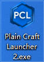
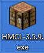
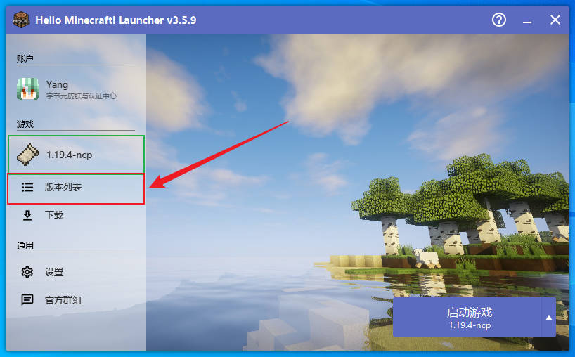
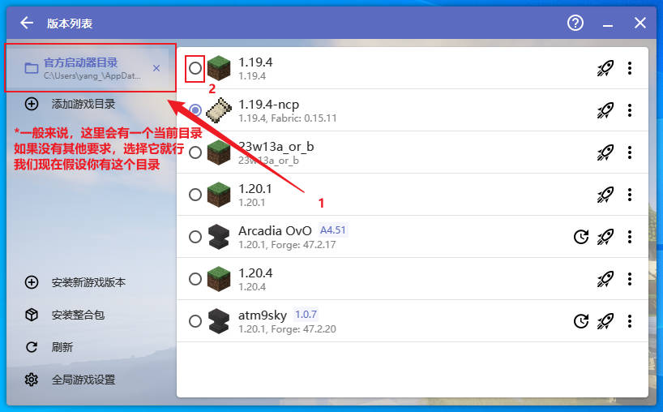
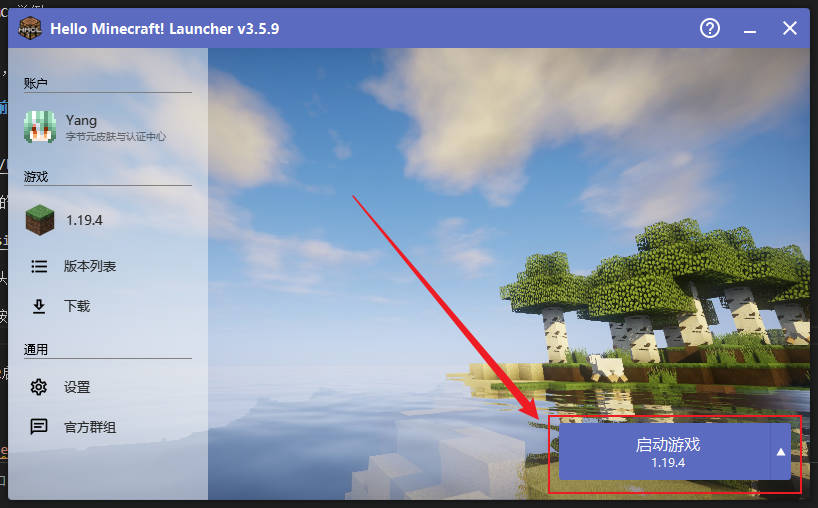
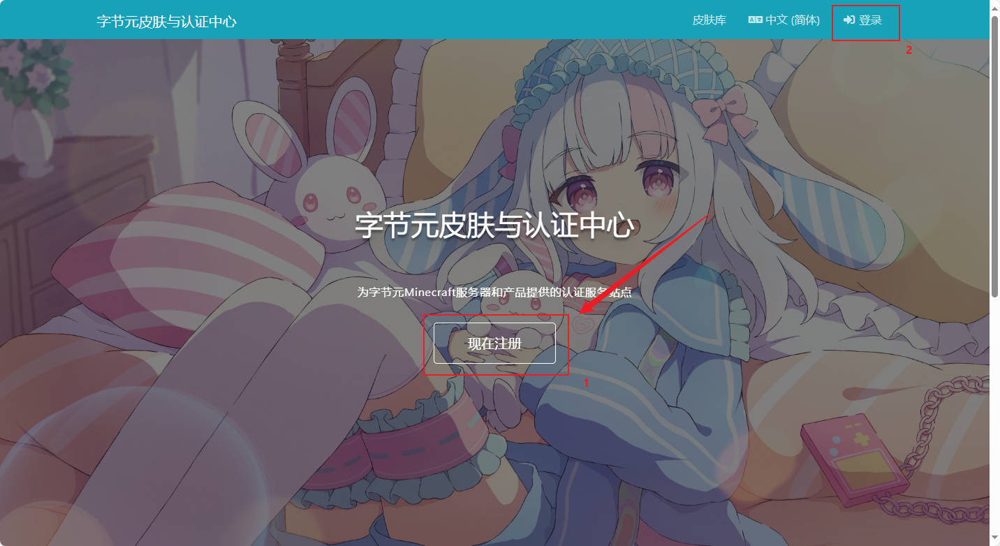
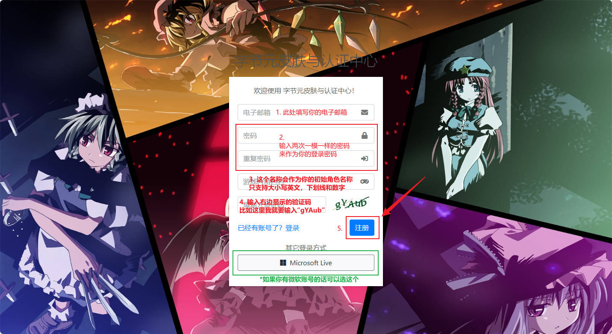
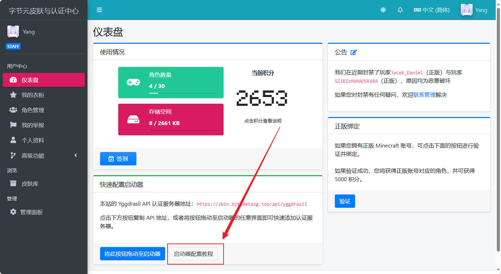

# 教 你 怎 么 玩 服 务 器

::: warning
如果您还没有购买Minecraft正版，请考虑立刻购买正版哦~

[购买Minecraft正版](https://www.minecraft.net/zh-hans/get-minecraft)（部分地区可能无法正常访问）
:::

::: tip
如果本文档无法解决您的问题（或是未出现的问题），请联系管理，管理可以手把手教您
:::

## 安装我的世界

在此之前，我们假定您的电脑是基于NT Core的Windows ~~（毕竟会用linux和mac的基本不会看教程）~~

如果您没有安装我的世界（Minecraft），或您的设备特殊（如手机），请前往[我的世界简易安装教程](./install-minecraft/)

如果您已安装，但不确定您的版本是否可用，请前往[确定你的我的世界版本](#确定你的我的世界版本)

## 确定你的我的世界版本

### 看启动器

打开您的启动器（如HMCL, PCL2），跟随教程进行操作：

::: details 启动器看起来是什么样子的？
请记住它们的图标：

这是PCL2的图标：


而这是HMCL的图标，它看起来像一个工作台：

:::

1. 双击您的启动器图标，打开您的启动器
::: tip
大部分启动器大同小异，这里以HMCL举例
:::

2. 找到您启动器的**版本管理**，可以参考如下截图
::: tip
如果**绿色框内**（也就是**当前版本**）已为合适版本时，您可直接跳过这一步
:::



打开版本选择页面后，请选择合适的版本（这里以**原版1.19.4**为例）



选择完毕后，点击左上角的`←`箭头返回到主界面

3. 最后就可以点击右下角的启动按钮来启动游戏了



::: warning
不同启动器有不同的布局（如PCL2启动器启动按钮在左下角），若您的启动器为其他启动器，请参考启动器相关文档获取帮助
:::

::: details 我仍然不会...
请善用<a href="javascript:seeerbaidu('我的世界%20启动器怎么用')">搜索引擎</a>
:::

::: details 启动器在哪里下载？
快点击下方链接 ~~（大雾）~~

[HMCL下载（Windows版）](http://mirrors.cloud.tencent.com/nexus/repository/maven-public/org/glavo/hmcl/hmcl-dev/3.5.7.246/hmcl-dev-3.5.7.246.exe)

[PCL2下载](https://ltcat.lanzoum.com/b0aj6gsid) 提取码：`pcl2`

\*Tip: PCL2需要解压后双击运行，我们**一般**不推荐直接在压缩包内打开运行哦~
:::

::: details 不会解压缩？
请善用<a href="javascript:seeerbaidu('电脑解压缩教程')">搜索引擎</a>
:::

## 注册皮肤站

<!-- ::: danger 【重要】账号迁移声明
自2023/7/15日后，离线玩家需要注册皮肤站，并额外设置Minecraft启动器后才可进入游戏。正版玩家不受影响。
::: -->

::: warning
当前内容不适用，请直接跳转到[进服地址](#进服地址)继续
:::

::: tip
为注册皮肤站，您需要拥有一个电子邮箱

若您没有，你可以查看教程或[联系管理员](./contact/)

[邮箱注册教程](./email-registration/)
:::

请点击导航栏中的[皮肤站](https://skin.bytemetasg.top/)按钮，该操作会自动跳转至皮肤站（如图）



::: tip
为了方便观察，我们降低了示例中背景图片的亮度
:::

点击下方的[现在注册](https://skin.bytemetasg.top/auth/register)按钮，将会跳转到注册界面，在该界面填写您的信息即可（如图）

::: tip
您或许还可以选择[Microsoft Live](https://skin.bytemetasg.top/auth/login/live)登录哦~
:::



[查看大图？](./skinlib_auth_2.jpg)

::: tip
完成注册后您可能需要打开您的邮件客户端或前往登录对应邮件服务商的网页版

邮件内有一封激活链接，点击打开即可完成注册
:::

::: details 我没有收到邮件？
你可以检查一下电子邮件的垃圾箱或者稍等一下再试哦~
:::

::: details 我还是没有收到邮件？？？
请与[管理员联系](./contact/)，我们会帮您处理
:::

注册完成后，您会自动跳转到注册用户的首页（如图）



您接下来只要关注`快速配置启动器`一栏即可

::: tip
直接跳转至[启动器配置教程](https://blessing.netlify.app/yggdrasil-api/authlib-injector.html#%E9%85%8D%E7%BD%AE%E5%90%AF%E5%8A%A8%E5%99%A8)？
:::

::: tip
您可以每天通过点击`签到`按钮来获取皮肤站内的积分哦~
:::

## 进服地址

- aismc.bid
- ais.yang-qwq.top
- mc.greenspray.cn

<!-- ::: warning
本服务器**不在中国教育网提供服务**
::: -->

::: details 我不会添加多人服务器...
请善用<a href="javascript:seeerbaidu('我的世界%20添加多人服务器')">搜索引擎</a>
:::

## 注册/登录账号

如果你是第一次来服务器，那么在进入之后，请务必执行如下的指令注册账号后，方可开始游玩：

::: tip
请将`<密码>`、`<重复密码>`替换为你自己的密码

如：`/reg mypassword mypassword`
:::

```plain
/reg <密码> <重复密码>
```

如果你已经完成了注册，请在接下来的每次进入服务器后输入登录命令：

```plain
/l <密码>
```

::: tip
如果你确实是第一次来到服务器，但聊天框内提示请使用`/l`登录，那么则意味着这个游戏ID已经被人占用了

请你更换一个游戏后再试
:::

## 进服第一步

该栏目下的命令均为必要或常用命令，在游玩时记牢可获得最佳体验~

### 获取工具

在默认情况下，新手套装在第一次进入时会默认发放

::: details 如果没有新手套装...
如果出于插件bug无法获取新手套装，请执行`/kit newbie`获取新手套装(包含附魔皮革套，工具一套，食物，及其他生存用品)
:::

### 传送

传送到某个玩家：`/tpa <玩家ID>`

接受玩家的传送：`/tpaccept`

拒绝玩家的传送：`/tpadeny`

让玩家传送到你：`/tpahere <玩家ID>`

随机传送：`/tpr`

传送到传送点：`/warp <传送点名字>`

::: tip
你知道吗：可以使用`/warps`获取所有可以使用的传送点哦~
:::

### 家

设置家：

```plain
/sethome [家的名字]
```

回去：

```plain
/home [家的名字]
```

::: tip
`/home bed`是传送到床旁边，除非你没床
:::

### 菜单

点击钟或者输入指令 `/cd`

### 私聊

```plain
/msg <玩家ID> <你想说的话>
```

或者

```plain
/tell <玩家ID> <你想说的话>
```

### 邮件

读邮件

```plain
/mail read
```

### 系统交易

卖掉手上的物品

```plain
/sell hand [数量]
```

卖掉特定的物品

```plain
/sell <物品ID> [数量]
```

卖掉物品栏中的方块

```plain
/sell blocks [数量]
```

卖掉所有能卖的物品

```plain
/sell all
```

[在此查看](./item-value/)服务器物品价格参照表

### 全球市场

打开市场列表：

```plain
/ca gui
```

发起拍卖：

```plain
/ca bid <价格> [数量]
```

出售：

```plain
/ca sell <价格> [数量]
```

收购：

```plain
/ca buy <价格> [数量]
```

打开市场邮箱

```plain
/ca mail
```

### 转账

向某位玩家付款：

```plain
/pay <玩家ID> <金额（0.01~3.4e+38）>
```

切换付款二次确认

```plain
/payconfirm
/payconfirmon  # 开启
/payconfirmoff  # 关闭
/payconfirmtoggle
```

::: details 如果您不再接受付款...
请执行`/paytoggle`
:::

## 粘液科技

### 获得指南

获取粘液科技指南: `/sf guide`

阅读粘液科技指南(但不获取书): `/sf open_guide`

::: tip
了解更多关于粘液科技的教程，请参考[粘液科技简易教程](./slimefun/)
:::

## 社交礼仪

由于服务器内的玩家们来自于中国乃至世界各个地方，难免会因为各种各样的问题产生冲突

所以我们应该尽可能做到：

- 多一份礼貌
- 多一份善良
- 尽可能不要爆粗口
- 做一些可能会影响其他玩家的事情时，应该先询问他人意见

当然，如果您遇到了不怀好心的玩家，您也可以向管理组举报，管理组会视具体情况给出处罚

互动案例请查看[社交礼仪典例](./social-example/)

## 圈地/保护领地

请参见[保护石插件简易教程](./protectionstones/)

## 创造世界

我们还建立了两个创造世界，分别是[超平坦地皮①](./worlds/#方块元日记·创造世界)以及[主世界地皮①](./worlds/#方块元日记·创造世界)

进入方法为：

依次找到`菜单`->`传送`->`功能性世界`->`超平坦地皮①`/`主世界地皮①`，并点击后即可进入

::: warning
如果你想在这些世界中创作的作品受到保护，请进行[圈地](#圈地-保护领地)
:::

## 扩展功能

::: tip
本栏目下的大部分功能都需要客户端安装对应mod以使用
:::

### 语音模组

你可以通过安装语音模组来使用服内语音功能

### 互动点歌

服务器内可以通过网易云与插件，实时点歌（可被服务器所有人听见）

详细教程请前往[点歌插件简易教程](./allmusic/)
