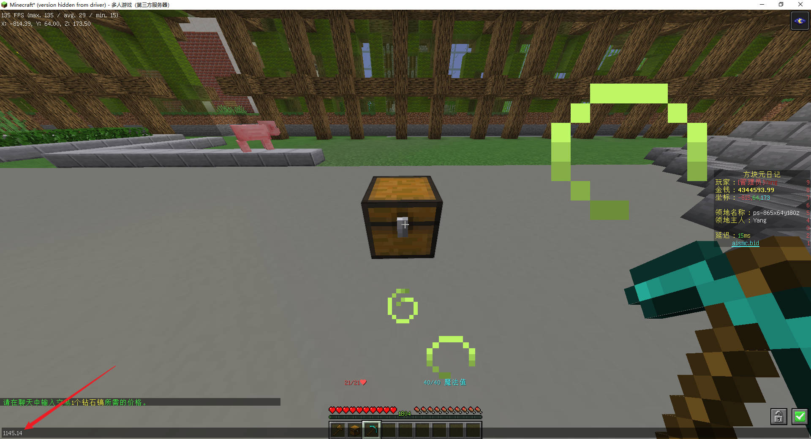
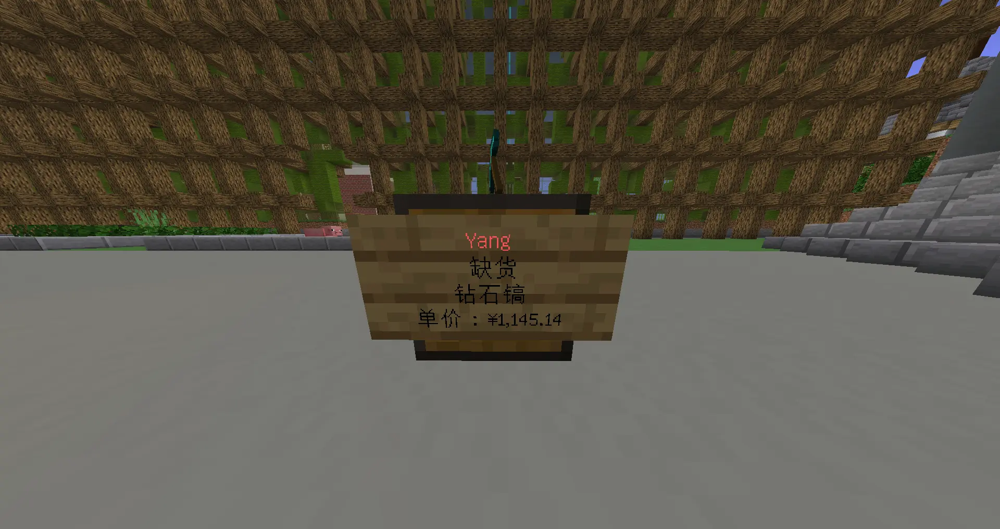

# 箱子商店

## 创建商店

将你的准星对准一个空箱子，手上放着你要出售/收购的东西（这里以钻石镐为例）

接下来，左键点击箱子，按照聊天框中的提示直接输入要出售/收购的价格（如图）

如果一切正确，那么你会看到箱子上多了个牌子（如图）：

那么恭喜，你已经创建了一个箱子商店！

## 为商店补货

::: warning
你不能在商店中放置与出售物品不符的东西

即使都是钻石镐，只要他们的属性不同，那就是不可售卖的
:::

## 从商店购买物品

## 修改商店属性
