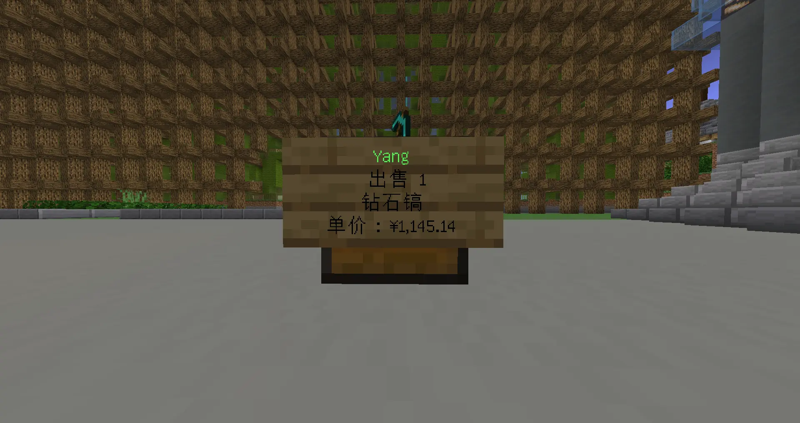
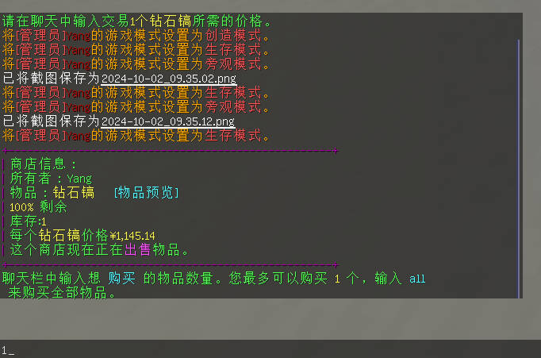
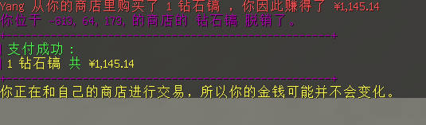
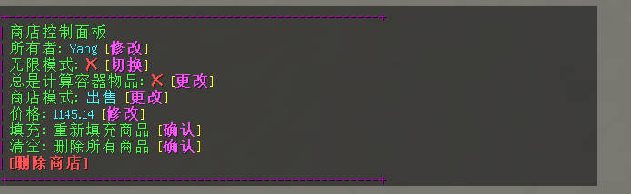

# 箱子商店

## 创建商店

将你的准星对准一个空箱子，手上放着你要出售/收购的东西（这里以钻石镐为例）

接下来，左键点击箱子，按照聊天框中的提示直接输入要出售/收购的价格


如果一切正确，那么你会看到箱子上多了个牌子：


那么恭喜，你已经创建了一个箱子商店！

## 为商店补货

一般来说，如果一个商店的物品卖完，箱子前的牌子会显示`缺货`，且名字会变红（同上图）

这时候，你需要准备好你要卖的物品，然后将其放入箱子中，即可完成补货。此时箱子会变绿，也会显示可用的物品数量：



::: warning
你不能在商店中放置与出售物品不符的东西

即使都是钻石镐，只要他们的属性不同，那就是不可售卖的
:::

## 从商店购买物品

当然，如果你想从其他商店购买物品，或者想在自己的商店买买买也是可以的

首先，你需要左键点击箱子上的牌子，然后会弹出如图的内容，你需要打开聊天栏进行输入：



然后，根据提示，输入你想要买的物品数量（输入`all`则为全部购买）

::: tip
注意，是直接输入，和你发聊天消息的时候一样：

```plain
all
```

而不是

```plain
/all
```

:::

如果成功，就会显示如图的提示：



## 修改商店属性

::: warning
只有商店主人才能进行此操作
:::

想要收购物品？或者觉得商店卖的太贵了？

没问题，你可以随时进行修改，而不用拆掉在建一个

首先，右键点击你商店上的牌子，然后会出现如下的信息，你可以直接在聊天栏内点击进行修改：


